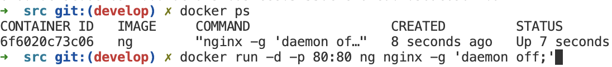

<h2>Part 1</h2>
образы

docker pull nginx 

docker run -d nginx

docker inspect

порт

порт

размер

остановка докера

проверка что он остановлен

docker run -p 80:80 -p 443:443 -d nginx

docker restart

<h2>Part 2</h2>
читаем конфигурацию

меняем через nano

применяем

проверяем

экспортируем и останавливаем

обратно импортируем

запускаем`

пс

проверка

<h2>Part 3</h2>
инструкция для убунту

sudo apt-get install libfcgi-dev
sudo apt-get install spawn-fcgi
sudo apt-get install nginx
sudo nginx -c %name%
or
cp nginx.conf /etc/nginx/nginx.conf

bash run sh

либо выполнить те инструкции которые указаны в докерфайле в 4 части

<h2>Part 4</h2>
docker build -t gcc12 . 

docker run -d -p 80:81 gcc35
docker run -d -p 81:81 gcc12

curl http://127.0.0.1:81/

<h2>Part 5</h2>
dockle gcc36 

после я поправил докер файл
export DOCKER_CONTENT_TRUST=1 
docker build -t 11:last .

<h2>Part 6</h2>

docker network create -d bridge --gateway 172.20.0.1 --subnet 172.20.0.0/24 fcgi_network

docker-compose build

docker-compose up

